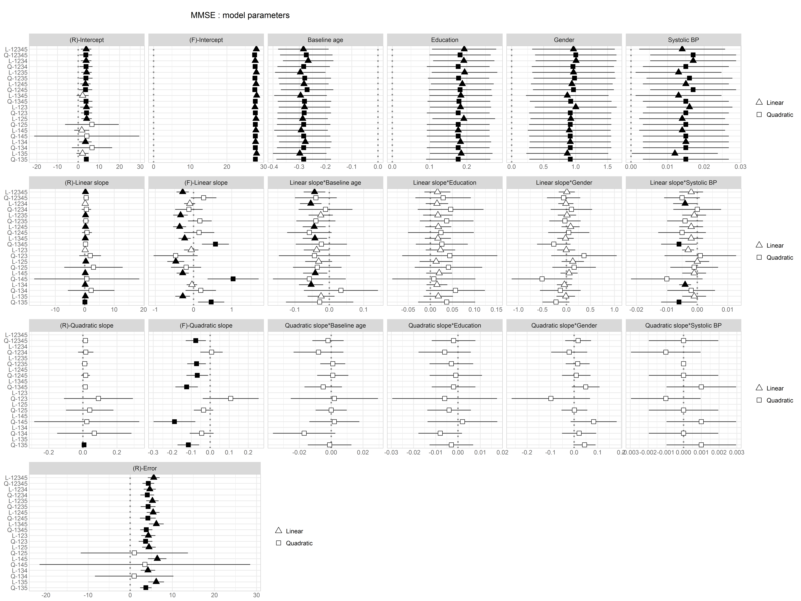

# MMSE
<!-- These two chunks should be added in the beginning of every .Rmd that you want to source an .R script -->
<!--  The 1st mandatory chunck  -->
<!--  Set the working directory to the repository's base directory -->


<!--  The 2nd mandatory chunck  -->
<!-- Set the report-wide options, and point to the external code file. -->


<!-- Load 'sourced' R files.  Suppress the output when loading packages. --> 

```
Warning: package 'ggplot2' was built under R version 3.3.2
```


<!-- Load the sources.  Suppress the output when loading sources. --> 


<!-- Load any Global functions and variables declared in the R file.  Suppress the output. --> 


<!-- Declare any global functions specific to a Rmd output.  Suppress the output. --> 


<!-- Load the datasets.   -->


<!-- Inspect the datasets.   -->

```
Observations: 22,764
Variables: 23
$ model_name   <fctr> u1_123_a_block, u1_123_a_block, u1_123_a_block, u1_123_a_block, u1_123_a_block, u1_123_a_bloc...
$ model_number <fctr> u1, u1, u1, u1, u1, u1, u1, u1, u1, u1, u1, u1, u1, u1, u1, u1, u1, u1, u1, u1, u1, u1, u1, u...
$ wave_set     <fctr> 123, 123, 123, 123, 123, 123, 123, 123, 123, 123, 123, 123, 123, 123, 123, 123, 123, 123, 123...
$ model_type   <fctr> a, a, a, a, a, a, a, a, a, a, a, a, a, a, a, a, a, a, a, ae, ae, ae, ae, ae, ae, ae, ae, ae, ...
$ process      <fctr> block, block, block, block, block, block, block, block, block, block, block, block, block, bl...
$ paramHeader  <chr> "Intercepts", "IA.ON", "IA.ON", "IA.ON", "IA.ON", "Intercepts", "SA.ON", "SA.ON", "SA.ON", "SA...
$ param        <chr> "IA", "AGE_C80", "EDU_C7", "FEMALE", "SBP_C167", "SA", "AGE_C80", "EDU_C7", "FEMALE", "SBP_C16...
$ effect       <chr> "Fixed effect", "Fixed effect", "Fixed effect", "Fixed effect", "Fixed effect", "Fixed effect"...
$ label        <chr> "(F)-Intercept", "Baseline age", "Education", "Gender", "Systolic BP", "(F)-Linear slope", "Li...
$ est          <dbl> 13.675, -0.535, NA, NA, NA, -0.154, 0.011, NA, NA, NA, NA, NA, NA, NA, NA, 39.359, 0.400, NA, ...
$ se           <dbl> 0.562, 0.132, NA, NA, NA, 0.097, 0.029, NA, NA, NA, NA, NA, NA, NA, NA, 3.175, 0.177, NA, 0.81...
$ est_se       <chr> "24.328", "-4.05", NA, NA, NA, "-1.594", "0.394", NA, NA, NA, NA, NA, NA, NA, NA, "12.398", "2...
$ pval         <dbl> 0.000, 0.000, NA, NA, NA, 0.111, 0.693, NA, NA, NA, NA, NA, NA, NA, NA, 0.000, 0.024, NA, 0.00...
$ est_pretty   <chr> "13.68", "-.54", "NA", "NA", "NA", "-.15", ".01", "NA", "NA", "NA", "NA", "NA", "NA", "NA", "N...
$ se_pretty    <chr> ".56", ".13", "NA", "NA", "NA", ".10", ".03", "NA", "NA", "NA", "NA", "NA", "NA", "NA", "NA", ...
$ pval_pretty  <chr> "<.001", "<.001", NA, NA, NA, ".11", ".69", NA, NA, NA, NA, NA, NA, NA, NA, "<.001", ".02", NA...
$ dense        <chr> "13.68( .56), <.001", "-.54( .13), <.001", "", "", "", "-.15( .10),   .11", " .01( .03),   .69...
$ N            <dbl> 420, 420, 420, 420, 420, 420, 420, 420, 420, 420, 420, 420, 420, 420, 420, 420, 420, 420, 420,...
$ parameters   <dbl> 8, 8, 8, 8, 8, 8, 8, 8, 8, 8, 8, 8, 8, 8, 8, 8, 8, 8, 8, 10, 10, 10, 10, 10, 10, 10, 10, 10, 1...
$ AIC          <dbl> 5846.786, 5846.786, 5846.786, 5846.786, 5846.786, 5846.786, 5846.786, 5846.786, 5846.786, 5846...
$ BIC          <dbl> 5879.109, 5879.109, 5879.109, 5879.109, 5879.109, 5879.109, 5879.109, 5879.109, 5879.109, 5879...
$ path         <chr> "./output/studies/octo/block/u1_123_a_block.out", "./output/studies/octo/block/u1_123_a_block....
$ table        <lgl> NA, NA, NA, NA, NA, NA, NA, NA, NA, NA, NA, NA, NA, NA, NA, NA, NA, NA, NA, NA, NA, NA, NA, NA...
```

<!-- Tweak the datasets.   -->


<!-- Basic table view.   -->


<!-- Basic graph view.   -->

```r
# d <- ds_catalog %>%
#   dplyr::filter(
#     # model_number == "u2",
#     # wave_set     %in% c("12345","1234","123","135"),
#     model_type   == "aefb",
#     process      == "grip"
#   ) %>% 
#   dplyr::mutate(
#     term = label,
#     estimate = est,
#     conf.low = estimate - 1.96*se,
#     conf.high = estimate + 1.96*se,
#     sign = ifelse(pval<=.05,T,F)
#   )

super_matrix(ds_catalog,"aefb","mmse")
```

```
Warning: Removed 10 rows containing missing values (geom_errorbarh).
```

```
Warning: Removed 10 rows containing missing values (geom_point).
```

```
Warning: Removed 10 rows containing missing values (geom_errorbarh).
```

```
Warning: Removed 10 rows containing missing values (geom_point).
```

```
Warning: Removed 10 rows containing missing values (geom_errorbarh).
```

```
Warning: Removed 10 rows containing missing values (geom_point).
```

```
Warning: Removed 10 rows containing missing values (geom_errorbarh).
```

```
Warning: Removed 10 rows containing missing values (geom_point).
```

```
Warning: Removed 10 rows containing missing values (geom_errorbarh).
```

```
Warning: Removed 10 rows containing missing values (geom_point).
```

```
Warning: Removed 10 rows containing missing values (geom_errorbarh).
```

```
Warning: Removed 10 rows containing missing values (geom_point).
```

```
Warning: Removed 10 rows containing missing values (geom_errorbarh).
```

```
Warning: Removed 10 rows containing missing values (geom_point).
```




